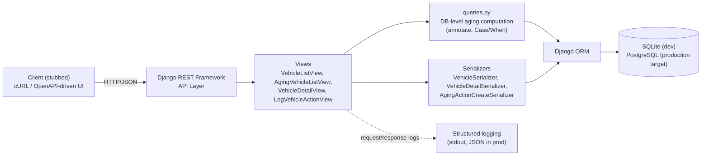

# System Design Document — Intelligent Inventory Dashboard

Scenario B (Supply domain). Backend service layer implementation per
`spec.md`. Client layer is stubbed via OpenAPI contract + cURL examples
(`openapi.yaml`, `curl_examples.md`).

## Architecture Diagram

## Component Roles

- **Views** (`views.py`): Thin HTTP layer. Read-only `ListAPIView`/
  `RetrieveAPIView` for vehicles, a single `CreateAPIView`-style endpoint
  for logging actions. Deliberately no `ModelViewSet` — full CRUD was
  rejected as broader than the spec requires (see AI Collaboration
  Narrative, README.md).
- **Serializers** (`serializers.py`): Shape API responses, compute
  `days_in_stock`/`is_aging` presentation fields, and validate writes
  (e.g. rejecting actions on non-`in_stock` vehicles).
- **queries.py**: Isolates the one piece of real business logic (the
  aging-stock rule) into DB-level query construction, kept separate from
  views so it's independently testable and reusable.
- **Models** (`models.py`): `Dealership`, `Vehicle`, `AgingAction`.
  `AgingAction` is an append-only audit log, not a mutable field on
  `Vehicle` — preserves full action history per vehicle.
- **Database**: SQLite for local dev/test (zero setup). Schema uses
  `db_index`/composite indexes on the filter/sort columns
  (`make`, `model`, `status`, `intake_date`) so the design carries
  cleanly to Postgres in production without query changes.

## Data Flow

1. Client issues `GET /api/vehicles/aging/?dealership_id=1`.
2. View extracts query params, calls `queries.get_annotated_vehicles()`
   which annotates `days_in_stock` and `is_aging` at the DB level (not
   computed in Python) and filters `status=in_stock` +
   `intake_date < today - 90 days`.
3. Queryset is paginated, serialized (`VehicleSerializer`), including
   each vehicle's `latest_action` via a single prefetch query (avoids
   N+1 — proven with `assertNumQueries`/`CaptureQueriesContext`, see
   README).
4. Manager reviews aging list, calls
   `POST /api/vehicles/{id}/actions/` with `{action_type, notes,
   created_by}`.
5. `AgingActionCreateSerializer` validates the vehicle is still
   `in_stock` before persisting; rejects with `400` otherwise.
6. New `AgingAction` row persisted, returned as `201` with the created
   record.

## Technology Choices

| Choice | Justification |
|---|---|
| Django + DRF | Fast to build a correct, conventional REST API; ORM makes DB-level aggregation (vs. Python loops) straightforward; built-in migrations, admin, test client. |
| SQLite (dev) → PostgreSQL (prod target) | SQLite needs zero setup for review/grading; schema and indexes are written to be Postgres-compatible (see `queries.py` vendor branch for `ExtractDay` vs `julianday`). |
| DB-level aggregation (`annotate`, `Case/When`) over Python loops | Correctness under pagination and at scale — a Python loop over a queryset breaks down as inventory grows into the thousands; DB-level filtering/sorting scales with proper indexes. |
| Explicit generic views over `ModelViewSet` | Matches the actual read/write surface required by spec.md; avoids exposing unreviewed write paths (PUT/PATCH/DELETE on vehicles were never a requirement). |
| OpenAPI 3.0 + cURL for client stub | Per assessment instructions; documents the real contract without building a throwaway frontend. |

## Observability Strategy

- **Logging**: Django's request logging (method, path, status, latency)
  to stdout in dev; JSON-structured logs in production (e.g. via
  `python-json-logger`) for ingestion by a log aggregator (CloudWatch,
  Datadog, etc.).
- **Metrics**: Key operational signals to track in production: request
  latency per endpoint (esp. `/vehicles/aging/`, the highest-read
  endpoint), query count per request (guard against N+1 regressions —
  already covered by a dedicated test), and count of `AgingAction`
  writes per day as a business metric.
- **Tracing**: Not implemented in this scope (single-service, no
  downstream calls), but the design leaves room for
  OpenTelemetry instrumentation on the DRF views if this service later
  calls out to other systems (e.g. a pricing service).
- **Testing as observability**: 17 automated tests cover boundary
  conditions (aging threshold), authorization surface (read-only
  enforcement), and performance regressions (N+1 query count), acting as
  a safety net independent of runtime monitoring.

## Assumptions (ambiguity resolutions)

1. Aging threshold is strictly `>90` days — day 90 itself is not yet
   aging (verified with boundary tests + a deliberate mutation test).
2. Only `status=in_stock` vehicles are eligible to be flagged as aging
   or to have new actions logged against them.
3. `AgingAction` is an append-only history, not a single overwritable
   status field — supports audit trail and matches "log and persist a
   status" more defensibly than mutation-in-place.
4. No authentication/authorization layer is in scope; `created_by` is a
   free-text field. Noted as a production gap, not implemented.

## GenAI Use in the Design Phase

The system design (data model, API contract, and this document's
architecture) was drafted by me first as a spec (`spec.md`) before any
code was generated, specifically to avoid letting an AI agent infer
ambiguous requirements (e.g. the aging-day boundary, whether actions
are append-only or overwritable). GenAI (via Antigravity) was then used
to implement against that spec in small, reviewed chunks — full process
and verification evidence documented in `AI_LOG.md` and the README's
AI Collaboration Narrative. GenAI was not used to make architectural
decisions independently; every schema/endpoint choice traces back to a
human-authored spec or a documented review decision (e.g. rejecting
`ModelViewSet` in favor of explicit read-only views).
